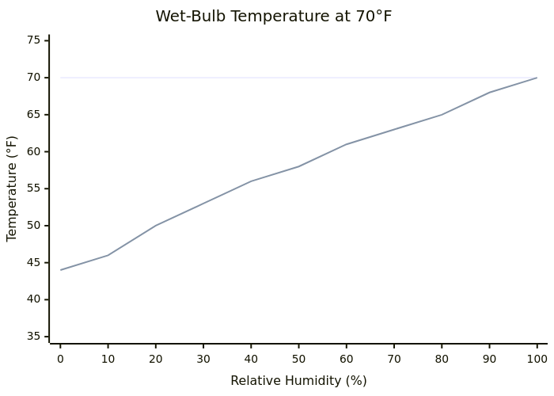
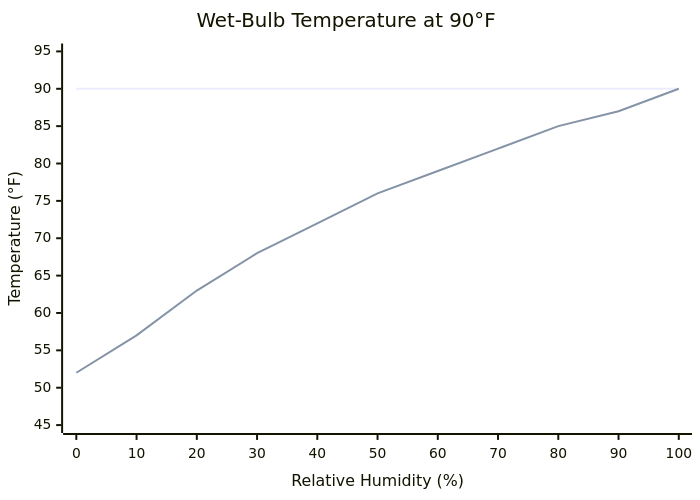
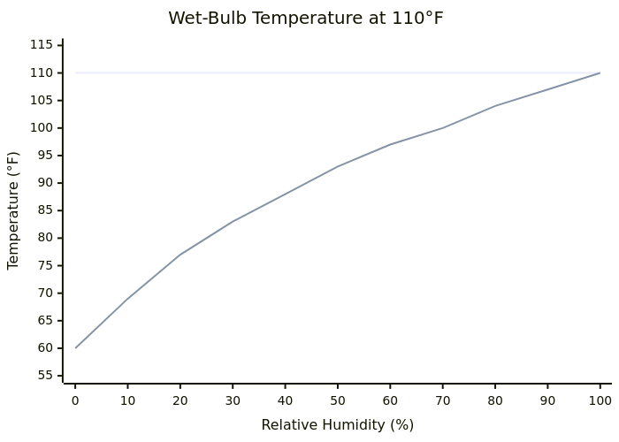

<!-- _class: title -->
<!-- _paginate: false -->

# Wet bulb termperature.

### (or why Kristof is always cold)

---

## Question

Let's imagine 2 people standing outside:

One in **Miami** on a July morning where it's **80°F** (26.7°C).
The other is in **Phoenix** on a July afternoon, and it's **115°F** (46.1°C).

**Where would you rather be?**

Before moving to the States I'd say Miami. Obviously. It's 35 degrees cooler. 80°F (26.7°C) sounds pretty nice.

But your body is dealing with **roughly the same heat load** in both places. In fact, as we'll see, Miami can get worse than Phoenix.

---

## Comparing numbers

| Location    | Air Temp  | Relative Humidity | Wet-Bulb Temp |
| ----------- | --------- | ----------------- | ------------- |
| Miami, FL   | **80°F** (26.7°C)  | 90%               | 77.6°F (25.3°C) |
| Phoenix, AZ | **115°F** (46.1°C) | 16%               | 77.2°F (25.1°C) |

Both produce a wet-bulb temperature around **77°F** (25°C).

Same wet-bulb means same experience for your body

To understand wet-bulb temperature, we first need to go over how our bodies cool themselves.

---

## How sweating cools you off

Your body generates heat constantly. ~80 watts at rest, 300 to 1,000 watts during exercise. That heat has to go somewhere or your core temperature climbs.

**Heat flows from hot to cold.** Never the other way.

Your body sheds heat through radiation, convection, and conduction, but all three only work when your skin is warmer than the air around it.

As the temperature difference between ambient and your skin temperature (~93°F / ~33.9°C) reduces, the efficiency of heat flowing away from you reduces.

Once over 93°F (33.9°C), these processes will actually heat you up, which is bad.

---

## Evaporation

But, we have one more trick up our sleeve...

For evaporation to work the air does not need to be cooler than your skin. Heat from your skin gets absorbed by sweat and gets **used up in the phase change** of your sweat from water to vapor.

One liter of sweat per hour, fully evaporated, removes ~675 watts of heat. That's enough to offset heavy exercise.

That's why a breeze feels good. Moving air speeds up evaporation which pulls heat away faster.

**But... your sweat needs to be able to evaporate.**

---

## Relative humidity

**Relative humidity (RH)** = moisture in the air as a percentage of the max it can hold at that temperature.

Meaning a low RH makes sweating more efficient, as your sweat can easily evaporate, and thus cool you down.

As RH goes up, this evaporation (and thus cooling) slows down.

---

## Wet-bulb temperature

**Wet-bulb temperature** = the lowest temperature air can reach through evaporation alone. Or temperature and humidity as one number.

You measure it by wrapping a thermometer in wet cloth and swinging it through the air. Water evaporates off the cloth and cools it down. Once it levels off, that's your wet-bulb temperature.

~95°F (35°C) is the maximum Wet-bulb temperatures humans can sustain.

---

### 70°F (21.1°C)

---

### 90°F (32.2°C)

---

### 110°F (43.3°C)

Good example of 'dry heat': at 10% RH, wet-bulb is only 69°F (20.6°C). (which is why I'm cold)

---

## Back to our example: Miami vs. Phoenix

- **Miami: 80°F (26.7°C), 90% humidity**: wet-bulb **77.6°F** (25.3°C)

- **Phoenix: 115°F (46.1°C), 16% humidity**: wet-bulb **77.2°F** (25.1°C)

So they actually feel the same.

<!-- ---

## Dew point

**Dew point** = the temperature where air gets fully saturated and moisture condenses out.

**Relative humidity shifts with temperature.** Heat the air, RH drops even if moisture stays the same. That's why RH is high in the morning and lower in the afternoon.

**Dew point doesn't move.** It's a direct measure of actual moisture in the air.

| Dew Point  | How It Feels              |
| ---------- | ------------------------- |
| Below 55°F | Comfortable, dry          |
| 55-65°F    | Noticeable but manageable |
| 65-70°F    | Humid, sticky             |
| 70-75°F    | Oppressive                |
| Above 75°F | Miserable                 | -->

---

## Dry heat

| Condition              | Wet-Bulb | Cooling from sweat |
| ---------------------- | -------- | ------------------ |
| Phoenix: 110°F (43.3°C), 10% RH | 69°F (20.6°C) | **41°F** (22.8°C) |
| Phoenix: 115°F (46.1°C), 5% RH  | 66°F (18.9°C) | **49°F** (27.2°C) |
| Miami: 90°F (32.2°C), 70% RH    | 82°F (27.8°C) | **8°F** (4.4°C)   |
| Miami: 85°F (29.4°C), 85% RH    | 81°F (27.2°C) | **4°F** (2.2°C)   |

Phoenix at 115°F (46.1°C): sweat gives you 49 degrees (27.2°C) of cooling. Miami at 85°F (29.4°C) gives you only 4 (2.2°C).

---

## Takeaway

When comparing temperatures, consider the humidity.
